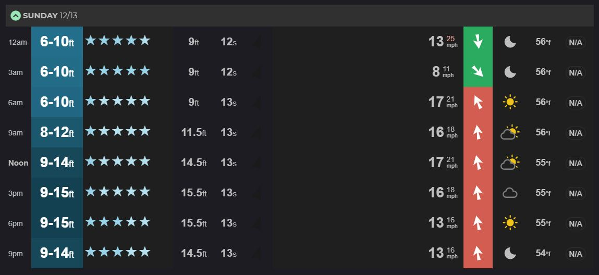
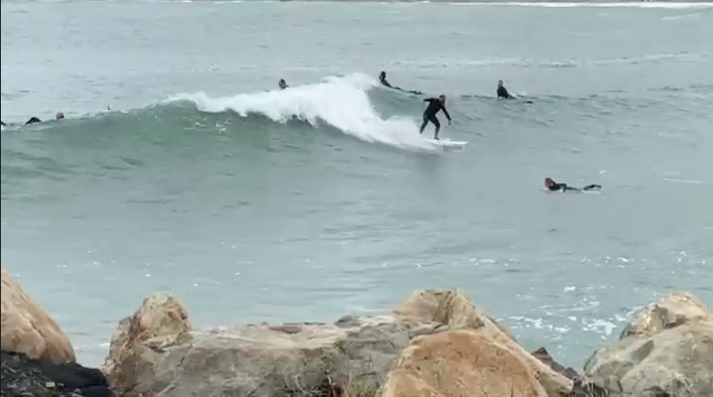
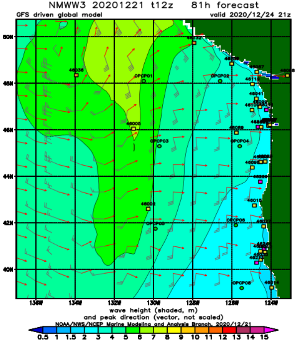

http://stream1.cmatc.cn/pub/comet/MarineMeteorologyOceans/
NearshoreWaveModeling/comet/oceans/nearshore_wave_models/print.htm#page_2.1.0
In this post I will describe what I believe are the three biggest problems with the various surf forecast/report services that are currently available, and why I think machine learning is well suited to address these problems. Ultimately, it's my view that **a surf forecasting service driven by machine learning has the potential toto provide more affordable, accurate forecasts to users in a way that better aligns with the values of surf culture.** 

Without wasting any time, let's dive in and start with the first and most obvious problem. Please note that for the sake of brevity, when I say 'surf forecast' I'm talking about both 'surf forecasts' (which are made in advance) and 'surf reports' (which describe the current conditions).

# Problem 1: Surf Forecasts are not Always Accurate 

Let me give an example. The following two images show day 0 forecast for a surf break in Wellington, NZ along with the actual observed conditions that day.

<figcaption>Forecast for a surf break in Wellington, NZ predicting 6-15 foot waves.</figcaption>

<figcaption>Observed waves of about 4 feet.</figcaption>

The photo on the bottom was taken at around the time when the forecast was predicting 9-15 ft waves. Assuming the surfer is a 6 ft human being, the waves are about 4-5 foot maximum. To understand why this forecast was so innaccurate (and to get some ideas about how we can improve it), we need to first understand how it was made. 

As far as I know, every surf forecast provider's first step in making a forecast begins the same: [NOAA's WAVEWATCH III (WW3) model](https://polar.ncep.noaa.gov/waves/). WW3 is a pubicly available global wind-wave model that predicts various conditions of the ocean, including signifcant wave heights and wave period. It works by taking the current conditions of the sea from buoy and satellite observations and 'forcing' those inputs using wind estimates from a different model by solving all the underlying physical equations. Because it makes predictions by taking into account the actual physics of the ocean, WW3 is what's known as a dynamical model. Below I've given an example of what the output of the WW3 model looks like.

<figcaption>WW3 model forecast of significant wave height and peak direction for a region of the US West Coast.</figcaption>

Given that WW3 predicts things like wave height and swell direction, you may be wondering why it can't be directly used to predict how the waves will be at your local surf spot. Why pay for a premium surf forecasting service when you can simply use the freely available WW3 model? The catch here is that WW3 predicts the characteristics of waves well offshore in deep water. Such waves are quite different than the near-shore waves that surfers ride. As a deep water wave aproaches the shore, it begins to transform due to a variety of complicated interactions with the sea floor. Factors such as the shape of the coast, how steep the sea floor is, and whether the ocean bottom is sand or hard coral are all critical to determining how a deep sea wave transforms into a near-shore breaking wave. While WW3 does a great job of predicting deep water wave characteristics, the complicated, highly nonlinear interactions in the surf zone described above are still not well enough understood to provide a reliable estimate of breaking wave height. (See [here](http://stream1.cmatc.cn/pub/comet/CoastalWeather/sww/comet/marine/SWW/print.htm) for a great article on some of these factors.)

But there's another issue here as well: the resolution of WW3. On a global scale, WW3 provides a data point every 60 x 75 nautical miles. Some regional models exist at 15 x 15 miles. Recently, NOAA began providing a super high resolution model for certain areas in the East and West coast regions of the US at a resolution of 4x4 miles. This is impressive, but still not adequate enough to get detailed predictions in the surf zone.

All of this boils down to one point: surf forecast services need a way of transforming WAVEWATCH III's deep water wave predictions into estimates of near-shore breaking waves that matter to surfers. Each service has their own method and since theyre all proprietary, I can't give specifics. There's plenty of scholarly articles out there that can give you an idea of what the common approaches probably look like. From my research, I get the impression that slope, tide, angle of beach, bathymmetry, etc. are all boiled down to likely a few simple equations, or possibly even one. In a way, forecasting breaking wave heights from deep water waves seems to be more of an art than a science, as knowledge of specific breaks is crucial to forming predictions. (MSW talks about it [here.)](https://magicseaweed.com/news/in-deep-water-swell-models-deconstructed/7507/)

Depending on the amount of near-shore data available and knowledge of the break by the forecaster, you're left with forecasts that vary in their degrees of accuracy. To go back to the example above in Lyall Bay, this forecast provider is US based, and as such probably doesn't put a lot of effort into New Zealand surf forecasts. It's likely that the forecaster simply chose to use to deep-water predictions from WW3 without any further corrections due to near-shore effects, which is why the forecast is so innacurate. It's an extreme but instructive example.

But even places where forecasters focus their attention are susceptible to error. For example, San Diego has plenty of different surf breaks, each with their own chaarcteristics. One important characteristic that determines how deep water waves transform into breaking waves is whether the spot is a reef or a sandy beach. If a surf forecasting method doesn't take these differences into account in the transformation equation, it will end up ignoring the fact that reefs typically produce better surfing waves on long period, while beach breaks do better with mid period waves, yet typically closeout on long period swell. This potentially leads to two locations getting the same forecast when in reality their conditions are quite different.

So what's stopping someone from simply making a better model? One that accounts for these complex near-shore interactions?

This leads us to problem two...

# Problem #2: Making Accurate Surf Forecasts is Expensive (both computationally and financially)

There are three obvious routes to improving surf forecasts:
1) make a better model
2) forget the models and simply put cameras everywhere
3) employ experts who can use model output to make detailed forecasts 

Regarding option 1: It's not that we don't know how to make better forecasts. Rather, the issue is that its too computationally expensive to run a model that solves all the shallow water physical interactions at a resolution that's sufficient to give good surf forecasts. While there are some near-shore models such as the SWAN Model, they are still somewhat experimental and computationally expensive. (https://www.whoi.edu/science/AOPE/dept/Publications/107.pdf)

Option 2 is already implemented by many forecast services. Surfline and MSW have cameras set up in the more popular surf spots which users can view online at any time (after paying a membership fee, of course). This certainly improves the problem of giving an accurate surf report (although it does nothing to improve forecasts), but comes with its own suite of issues including angry locals who want to keep their spot secret (more on this later), and the fact that maintening the necessary ifnrastructure for hundreds of cameras along the coast is expensive. 

Option 3 is also utilized by various forecast services. Surfline has a team of 12 forecasters that make predictions for surf in various locations. The issue here again is one of scale. To give an analogy, think back to a weather forecast that you might have seen on the local news. You probably heard phrases like 'there's an 80% chance of strong thunderstorms for the Atlanta metropolitan area today, with a high risk of strong winds greater than 50 mph and hail, and possibly a tornado.' Notice that the scale of this forecast is for the entire city. The forecaster isn't telling each street or individual househol what the weather will be like in their backyard. Furthermore, the forecast doesn't specify the exact strength of the winds, but rather gives a probability that certain strength of winds could occur (high risk of winds greater than 50mph). It's simply too computationally expensive (if not outright impossible) and time consuming for the forecaster to give each individual resident of the city a prediction of what the weather will be like in their own backyard. Surf forecasting can be thought of in a similar way. Swell events affect entire regions and a general forecast is given for stretches of the coast in said regions (e.g., 3-4 ft waves in the San Diego region). But surfers need (or want) more specifics, and they want them for each individual surf spot. In essence, surfers want to know what the weather will be like in their backyard.

 Considering there's more than 100 surf spots in San Diego County alone, we can begin to see why getting a detailed surf forecast/report for each individual break is impossible. While it's true that some breaks behave very similarly, it would still require many more forecasters than there currently are to get the level of accuracy and coverage that surfers want. Such a business model isn't even financially sustainable.
 
And what if it were? What if Jeff Bezos was an avid surfer and paid 100 forecasters every day to each make a detailed froecast/report for all 100+ breaks in San Diego County? Would this actually be a good thing? To answer this question, we need to talk about issue number three.

# Problem #3: Forecasting Services Need to Better Consider Surf Culture

There are a lot of ways one could describe surf culture, but in my opinion there are three characteristics which are shared by almost all surfers:

1) **They value exploration and discovery.** It's considered poor etiquette to tell the whole world about certain high quality surf spots. Rather, it's up to each surfer to discover such spots on their own by putting in the time and effort to gain the appropriate experience and knowledge.
2) **They're protective of their local surf breaks.** This topic could be a blog post on its own. For better or worse, surfers don't like when their favorite spot is swarmed by lots of new surfers that don't know or respect the rules of the break.
3) **They care about protecting the Earth's oceans.** This one isn't even a problem, but it's something we need to keep in mind. Surfers recognize that the oceans are the source of their favourite hobby, and as such, they desperately want to keep them clean and safe.

The current business model of surf forecasting flies contrary to these three core values. For example, a map showing all 100+ surf breaks in San Diego, each with its own rating and detailed report, blasted out to the whole world is in my opinion, the antithesis of surf culture.

The whole situation is certainly a condundrum. Surfers want better forecasts, but better forecasts for them means better forecasts for everyone, which means more people in the water and thus more competition for the best waves. Perhaps even more insidious is the fact that such a service deprives new surfers the invaluable experienced gained by discovering new breaks for themselves and identifying under what conditions each break works best. This learning period is vital to building within each surfer a sense of respect for the oceans and for their fellow surfers who have gone through a similar process. When a new surfer is able to skip this learning phase and instead simply open up google and find the best surf spot in the region and drive out on a 'five-star' day, they will inevitably lack the appreciation and respect for the surf break and for the other surfers there. At its worst, such a business model can lead to a generation of surfers who view the ocean as a commodity to be exploited for their pleasure rather than a sensitive ecosystem to be protected. 

For this reason, any improvements in surf forecasting should come with the added responsibility of providing them in a way which stays true to the core values of surf culture and helps to create educated and responsible surfers.

# Machine Learning as a Solution to Surf Forecasting's Problems

So with these three issues in mind, I began wondering how we could make a better forecast/report system. One in which the forecasts are more accurate, more affordable, and also protect the core values of surf culture by educating surfers.

This led me to begin developing SurfSense, an app which uses machine learning to make individualized surf forecasts and reports in the San Diego area. A machine learning model is kind of like any other model in that it uses information to make predictions. The difference is in how that prediction is made. Recall that WAVEWATCH III is a dynamical model, which means it predicts the state of the ocean by solving the governing physical equations. Machine learning models don't try to solve the non-linear physical equations like dynamical models, but rather find patterns by analyzing a 'training dataset' and then using that knowledge to make future predictions. 

What does this process look like in the context of SurfSense? Each time a surfer finishes a session, they submit a 'report card' in which they rate how good the waves were that day (e.g., 'waves were clean and head high'). This report card is then saved into the training dataset as a label. At the same time, SurfSense automatically collects all the other important information which led to the waves being the way they were that day. This includes things like buoy observations of swell, period direction, tide, winds, and yes, WW3 model deepwater forecasts. This information is saved as the features of the training dataset. The model is then taught to find patterns between the labels and features of the training dataset. Once trained, it is then able to make predictions about the wave quality based on observed or predicted conditions. This type of model has the potential to be much more affordable, as it ideally removes the need for a team of paids forecaster or an army of beach cameras. Furthermore, the computational cost is also lowered by removing the need for high resolution dynamical models that predict complex, surf-zone characteristics. 

It's important to understand that each individual user of SurfSense will have their own training dataset based on their own surf reports. As a result, each surfer has their own personal wave model. This is beneficial for a few reasons. First, by building a model based on individual user ratings, we ensure that each user knows exactly what to expect when SurfSense provides them with a forecast. Some surfers prefer gentle, slow waves, while others prefer hollow, barrelling waves. A longboarder's '4 star rating' may be different from a shortboarder's '4 star rating'. By keeping the user's training datasets separate, we are able to give a higher degree of personalization to each forecast. Perhaps more importantly, this system encourages surfers to have a more healthy relationship with the ocean by making a direct connection between model accuracy and the amount of energy and time spent by the surfer surfing. In this way, SurfSense is meant to help surfers make the most of the experience gained during each surf session, ultimately making an accurate model while also enhancing their own understanding, or sense, of the break; hence the name. 

The final question is if this will actually lead to better forecasts. The key here will be in the specifics of the machine learning model used in SurfSense. Domain knowledge of surf forecasting methods and understanding of machine learning is crucial to developing an optimal approach. For example, it's generally accepted that machine learning models require massive training datasets numbering tens to hundreds of thousands of instances in order to be accurate. This is less than ideal if each individual user's training dataset consists of each surf event. As much as they'd prefer, it's simply not possible for surfers to surf hundreds of thousands of times. But using some knowledge of the physical interactions of the ocean along with an understanding of the various machine learning approaches, it's actually possible to create a useful model that does not require massive amounts of training data. Rather, it may be possible that a reasonable model could be trained after only one season of surfing (which is certainly shorter than how long it takes to even learn how to surf). 

In the coming months I'll continue building the SurfSense user interface and begin testing the underlying data-driven forecast model. Stay tuned. 

{: .mx-auto.d-block :}

